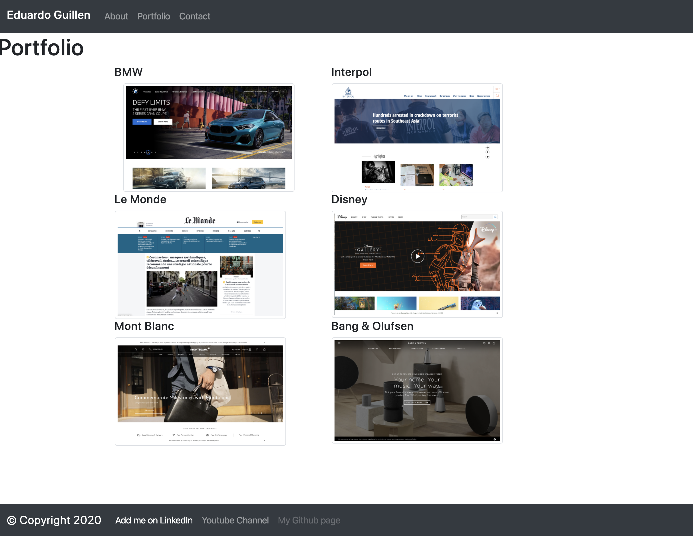
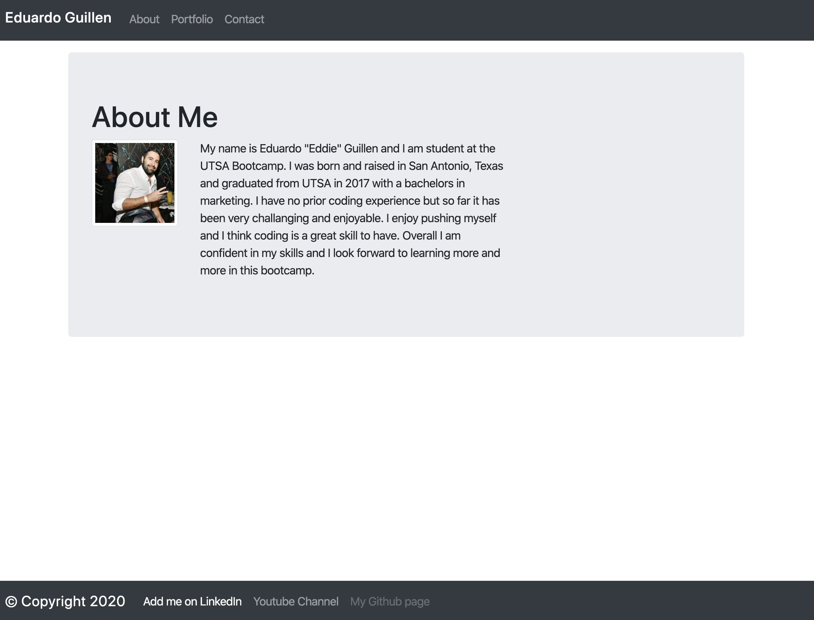
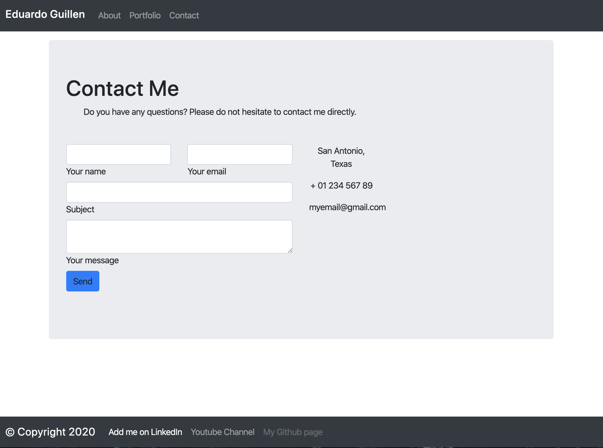

# Unit 02 CSS and Bootstrap Homework: Responsive Portfolio

For this homework assisgnment we are tasked to create responsive web pages showcasing an example portofolio site by primarly using Bootstrap CSS Frameworks. 

## Getting Started

To access the webpages please visit https://eguillen117.github.io/Homework-Week-2-EG-042520/

To access the raw code you may visit github https://github.com/eguillen117/Homework-Week-2-EG-042520/

### Prerequisites
GitHub
Visual Studio Code

### Screenshots and Examples

## Built With Visual Studio Code and Bootstrap

* [VCS]
* [Bootstrap]

## Authors

* **Eduardo Guillen ** - [UTSA BCS](https://github.com/eguillen117

## License

This project is licensed under the MIT License - see the [LICENSE.md](LICENSE.md) file for details

## Acknowledgments

* Hat tip to Bootstrap
* Godfre,Best for support
* My dog Elise
